# Modular Face Recognition API

A robust, modular, and accurate API for face verification and registration, built with FastAPI and DeepFace. This system is designed to ensure image quality, prevent duplicate user registrations, and block specific individuals (e.g., employees) from signing up.

The architecture is highly modular, separating concerns like image processing, embedding management, and API logic, making it easy to maintain and extend.

## ✨ Key Features

- **High-Accuracy Face Detection**: Uses a fallback chain of state-of-the-art detectors (`RetinaFace` → `MTCNN` → `Dlib`) to reliably find faces, even in challenging conditions like wearing glasses.
- **Intelligent Image Quality Checks**:
  - **Blur Detection**: Analyzes the sharpness of the *face itself* (not the whole image) to reject low-quality submissions.
  - **Image Normalization**: Automatically resizes overly large images for consistent and faster processing.
- **Duplicate & Blocklist Verification**:
  - Compares new faces against existing users to prevent duplicate accounts.
  - Maintains a separate "employee" blocklist to forbid certain individuals from registering.
- **Modular & Scalable Codebase**: The project is split into logical modules (`face_processor`, `embedding_manager`, `main`, `config`) for easy debugging and future expansion.
- **Configuration Driven**: All key parameters (thresholds, model names, file paths) are managed in a `.env` file, allowing for easy tuning without code changes.
- **Automatic API Documentation**: Leverages FastAPI to provide interactive API documentation (via Swagger UI) out of the box.

## ⚙️ Technology Stack & Algorithms

| Component              | Technology / Algorithm                |
|:-----------------------|:--------------------------------------|
| **Backend Framework**  | FastAPI, Uvicorn, Pydantic           |
| **Face Detection**     | RetinaFace, MTCNN, Dlib (HOG + SVM)  |
| **Face Recognition**   | Google's Facenet (Deep CNN)          |
| **Face Verification**  | Cosine Similarity                     |
| **Blur Detection**     | Variance of the Laplacian             |
| **Data Handling**      | Pandas, Scikit-learn, NumPy          |
| **Configuration**      | python-dotenv                         |

## 📂 Project Structure

```
face-recognition-api/
├── .env                    # Stores all configuration and secrets
├── main.py                 # Main FastAPI application, defines all API endpoints
├── config.py               # Loads and provides settings from the .env file
├── face_processor.py       # Handles all core CV tasks: face detection, blur checks, embedding generation
├── embedding_manager.py    # Manages loading, saving, and querying face embeddings
└── requirements.txt        # Lists all Python dependencies
```

## 🚀 Getting Started

Follow these steps to set up and run the project locally.

### 1. Prerequisites

- Python 3.8+
- pip (Python Package Installer)

### 2. Clone the Repository

```bash
git clone https://github.com/Devvlakshay/Face_reco/blob/main/Using-FastAPIs/
cd Using-FastAPIs
```

### 3. Set Up a Virtual Environment

It is highly recommended to use a virtual environment.

**Windows:**
```bash
python -m venv venv
.\venv\Scripts\activate
```

**macOS / Linux:**
```bash
python3 -m venv venv
source venv/bin/activate
```

### 4. Install Dependencies

Create a `requirements.txt` file with the content below, and then install the packages.

**requirements.txt:**
```txt
fastapi
uvicorn[standard]
python-dotenv
requests
pandas
numpy
scikit-learn
Pillow
python-multipart
opencv-python
deepface
dlib
```

**Installation command:**
```bash
pip install -r requirements.txt
```

> **Note:** This step may take several minutes as it downloads the required deep learning models and libraries.

### 5. Create Configuration File

Create a file named `.env` in the root of the project and paste the following configuration. You can tune these values as needed.

```ini
# .env file

# --- Model Configuration ---
MODEL_NAME="Facenet"
PRIMARY_DETECTOR="retinaface"
SECONDARY_DETECTOR="mtcnn"
TERTIARY_DETECTOR="dlib"

# --- Thresholds ---
USER_SIMILARITY_THRESHOLD=0.70
EMPLOYEE_SIMILARITY_THRESHOLD=0.60
FACE_CONFIDENCE_THRESHOLD=0.90
BLUR_THRESHOLD=100.0

# --- File Paths ---
USER_EMBEDDINGS_FILE="user_embeddings.pkl"
EMPLOYEE_EMBEDDINGS_FILE="employee_embeddings.pkl"
```

### 6. Run the Application

```bash
uvicorn main:app --reload
```

The API will now be running at `http://127.0.0.1:8000`.

### 7. Access Interactive API Docs

Once the server is running, open your browser and navigate to `http://127.0.0.1:8000/docs` to view and interact with all the API endpoints.

## 📋 API Endpoints

A detailed guide to all available endpoints.

### 1. User Face Verification

**POST /check-face-file**
- **Description**: Verifies and registers a user's face via file upload.
- **Request**: `multipart/form-data` with fields `user_id` (string) and `file` (file).

**POST /check-face-url**
- **Description**: Verifies and registers a user's face via a public image URL.
- **Request**: `application/json` with body `{"user_id": "string", "image_url": "string"}`.

#### Responses for User Verification

- **200 OK**: `{"status": "new_face_registered", ...}`
- **200 OK**: `{"status": "duplicate_face_found", ...}`
- **400 Bad Request**: `{"status": "blur_image_detected", ...}`
- **400 Bad Request**: `{"status": "failed", "message": "No face detected..."}`
- **403 Forbidden**: `{"status": "employee_face_detected", ...}`

### 2. Employee Registration

**POST /register-employee-file**
- **Description**: Registers an employee's face via file upload for the blocklist.
- **Request**: `multipart/form-data` with fields `employee_id`, `employee_name`, and `file`.

**POST /register-employee**
- **Description**: Registers an employee's face via a public image URL.
- **Request**: `application/json` with body `{"employee_id": "...", "employee_name": "...", "image_url": "..."}`.

#### Responses for Employee Registration

- **200 OK**: `{"status": "employee_registered_successfully", ...}`
- **409 Conflict**: `{"status": "failed", "message": "Employee ID already exists."}`

> **Note:** Also returns 400 Bad Request for blurry/invalid images.

### 3. Management Endpoints

**GET /employees**
- **Description**: Retrieves a list of all registered employees.

**DELETE /employee/{employee_id}**
- **Description**: Removes an employee from the system.

**DELETE /user/{user_id}**
- **Description**: Removes a user from the system.

## 🧠 System Workflow

The API follows a strict, sequential pipeline to validate every image submitted. If a check fails at any stage, the process is immediately halted and a specific error is returned.

```mermaid
graph TD
    A[Start: Image Submitted] --> B{Is Image Valid?}
    B -- No --> B_Fail[❌ Stop: Invalid Image Error]
    B -- Yes --> C{Detect a Face?}
    C -- No --> C_Fail[❌ Stop: No Face Detected Error]
    C -- Yes --> D(Crop to Face Area)
    D --> E{Is Face Clear? Not Blurry}
    E -- No --> E_Fail[❌ Stop: Blur Image Detected Error]
    E -- Yes --> F(Generate Face Fingerprint)
    F --> G{Is Person an Employee?}
    G -- Yes --> G_Fail[❌ Stop: Employee Face Detected Error]
    G -- No --> H{Is Person a Duplicate User?}
    H -- Yes --> H_Fail[✅ Stop: Duplicate Face Found Response]
    H -- No --> I[✅ Success: Register New User]
```



## 📄 License

This project is licensed under the MIT License. See the LICENSE file for details.